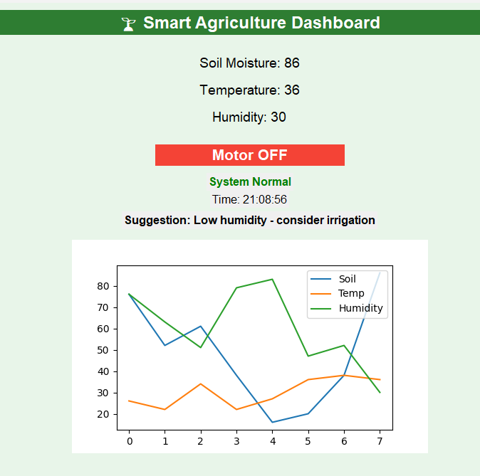
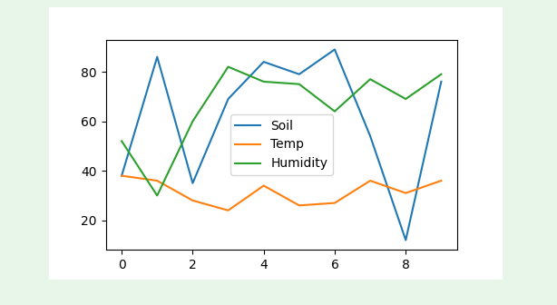
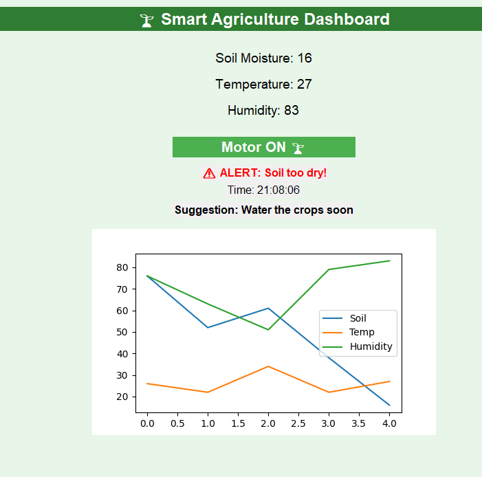
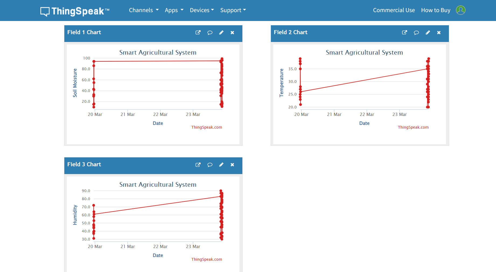

# 🌱 Smart Agriculture Monitoring System

## 📌 Description
This project is a smart agriculture monitoring system that tracks environmental conditions such as soil moisture, temperature, and humidity. It automatically controls irrigation based on real-time data and provides intelligent suggestions.

## 🚀 Features
- Real-time monitoring of soil, temperature, and humidity
- Automatic irrigation control (Motor ON/OFF)
- Live data visualization using graphs
- Alert system for critical conditions
- Smart suggestion system
- Cloud integration using ThingSpeak

## 🛠️ Technologies Used
- Python
- Tkinter (GUI)
- Matplotlib (Graph visualization)
- CSV (Data storage)
- ThingSpeak (Cloud platform)

## 📱 Cloud Integration
The system sends data to the ThingSpeak cloud platform, allowing users to monitor data remotely using a mobile device or web browser.

## ▶️ How to Run
1. Install required libraries:
2.  Run the Python file:
  ## 📸 Project Screenshots

### 🖥️ GUI

###  Humidity

### 📊 Graph

### ⚠️ Alert

### ☁️ Cloud (ThingSpeak)

## 🔮 Future Scope
- Integration with real IoT sensors
- Mobile application development
- AI-based prediction system
- Cloud-based analytics

## 👨‍💻 Author
MEKALA SRITEJA
